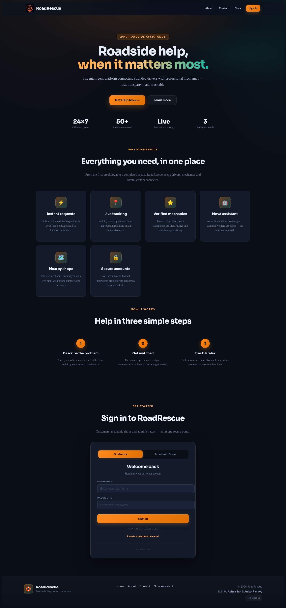
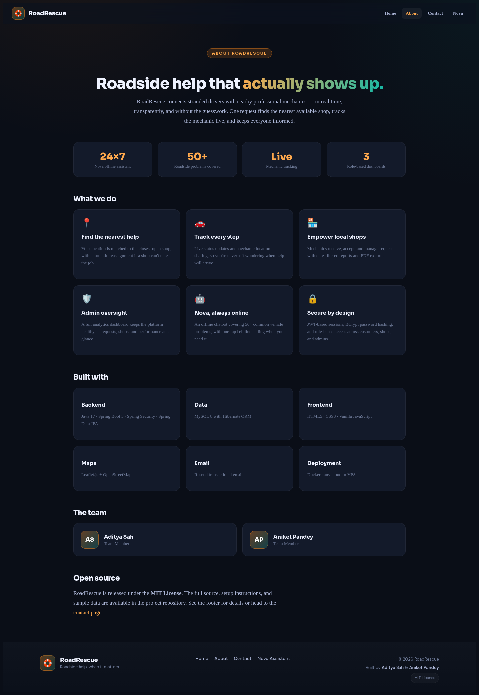
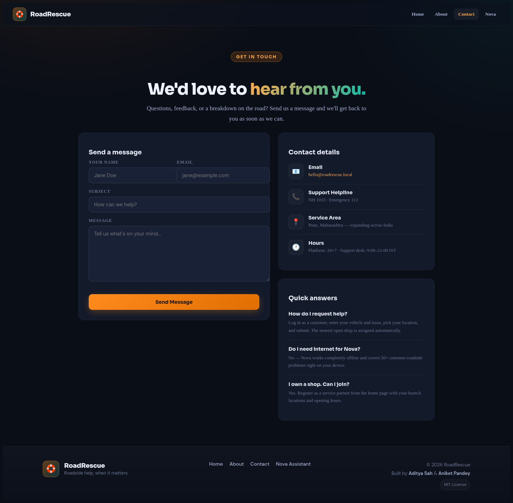
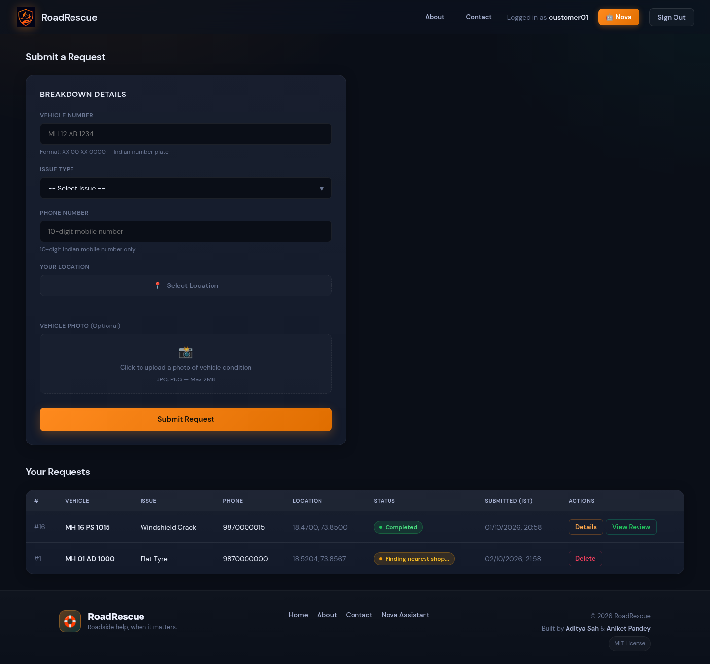
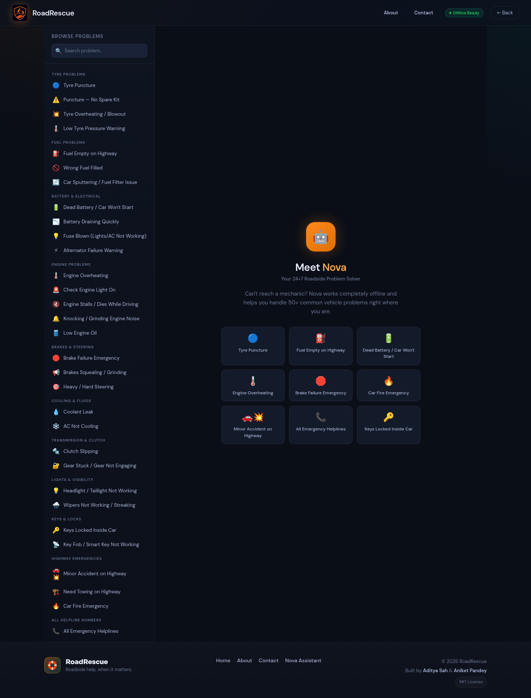
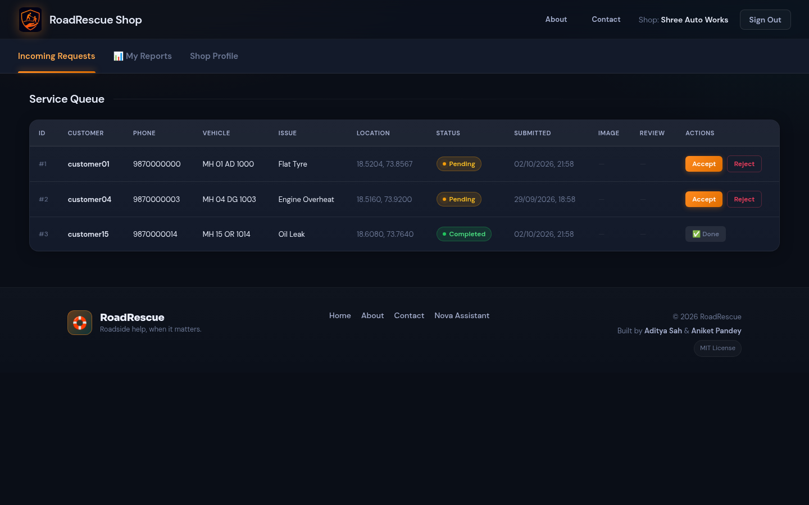
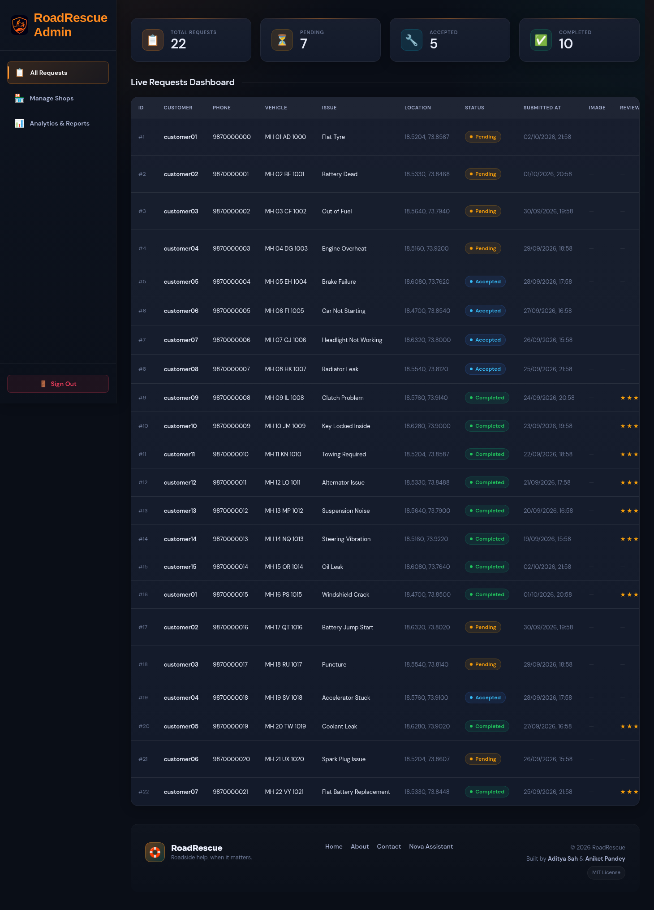
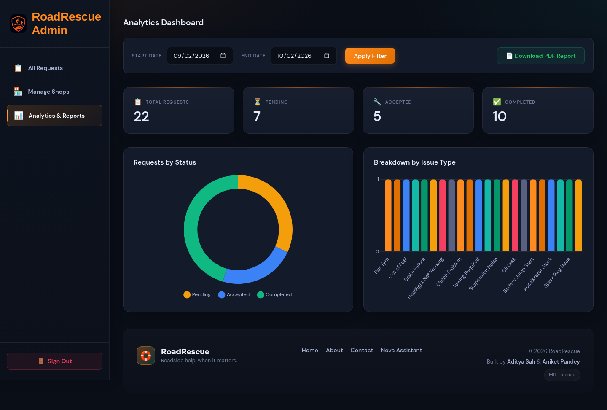
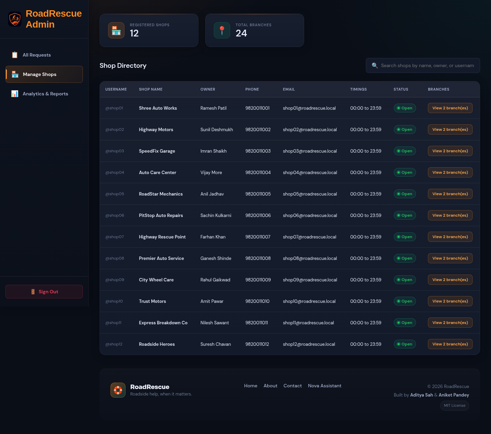

<div align="center">

# RoadRescue — Smart Roadside Assistance

**Roadside help, when it matters.**

The intelligent platform connecting stranded drivers with professional mechanics — fast, transparent, and trackable.

[](https://openjdk.org/)
[](https://spring.io/projects/spring-boot)
[](https://www.mysql.com/)
[](https://www.docker.com/)

</div>

---

## 📸 Screenshots

### 🔐 Login Page


### ℹ️ About


### ✉️ Contact


### 👤 Customer Dashboard


### 🤖 Nova — Offline Chatbot


### 🔧 Shop Dashboard


### 🛡️ Admin — Requests Dashboard


### 📊 Admin — Analytics


### 🗺️ Nearby Shops Map


---

## ✨ Features

### 👤 Customer
- Register & login securely
- Submit breakdown requests with vehicle number, issue type, phone & live location
- Upload vehicle photo (optional)
- Track request status in real-time
- View nearby mechanic shops on an interactive map (Leaflet + OpenStreetMap)
- Live tracking of mechanic
- **Nova** — offline 24×7 chatbot for 50+ roadside problems

### 🔧 Mechanic Shop
- Register shop with branch locations, opening hours & contact details
- Receive and manage incoming breakdown requests
- Accept / complete / reject customer requests
- Email notifications on new requests
- Filter by date range & download PDF reports of owned shop

### 🛡️ Admin
- View and manage all service requests
- Manage registered shops
- Analytics dashboard — total requests, pending, accepted, completed
- Filter by date range & download PDF reports of all shops
- Live tracking of mechanic

### 🤖 Nova (Offline Chatbot)
- Works 100% offline — no internet needed
- Covers 50+ problems across 10 categories:
  - Tyre Problems, Fuel Issues, Battery & Electrical
  - Engine Problems, Brakes & Steering, Cooling & Fluids
  - Transmission & Clutch, Lights & Visibility, Keys & Locks
  - Highway Emergencies
- One-tap call buttons for government helplines (NH 1033, 100, 108, 101, 112)
- All major manufacturer assist numbers (Maruti, Hyundai, Tata, Honda, Toyota, etc.)

---

## 🛠️ Tech Stack

| Layer | Technology |
|---|---|
| Backend | Java 17, Spring Boot 3, Spring Security, Spring Data JPA |
| Database | MySQL 8.0 |
| Frontend | HTML5, CSS3, Vanilla JavaScript |
| Maps | Leaflet.js + OpenStreetMap |
| Email | Resend (with JavaMail fallback) |
| Deployment | Docker, Render / Railway / any VPS |
| Build Tool | Maven |

---

## 🚀 Run Locally

The frontend calls the API on the **same origin** (`const API = ""`), so the same build works everywhere — locally and when deployed. No URL changes needed when the host changes.

### Option A — Docker (recommended, one command)

Starts both MySQL and the app. A fresh `RoadRescueDB` is created automatically on first run.

```bash
cp .env.example .env      # optional: set DB_PASSWORD / ADMIN_EMAIL
docker compose up -d --build
```

Open: **http://localhost:8082**

To stop: `docker compose down` (add `-v` to also delete the database volume).

### Option B — Maven + local MySQL

**Prerequisites:** Java 17+, Maven 3.6+, MySQL 8.0.

**1. Create the database**
```sql
CREATE DATABASE RoadRescueDB;
```

**2. Configure environment variables**

Note: the built-in default points at the Docker host `roadrescue-mysql`, which will not resolve on your machine — so you **must** override `DB_URL` for this path.

```env
DB_URL=jdbc:mysql://localhost:3306/RoadRescueDB
DB_USERNAME=root
DB_PASSWORD=your_password
ADMIN_EMAIL=you@example.com
# RESEND_API_KEY=re_your_resend_api_key   # optional; emails are skipped without it
```

**3. Run the application**
```bash
mvn spring-boot:run
```

**4. Open in browser**
```
http://localhost:8082
```

> A default admin account is created on first boot — username `admin`, password `admin123`. Change it after first login.

---

## 🧪 Sample Data & Demo Logins

To populate the app with demo users, shops and requests:

```bash
docker exec -i roadrescue-mysql mysql -uroot -proadrescue123 RoadRescueDB < db/seed.sql
```

This loads **1 admin + 15 customers, 12 shops, 22 service requests**. See
[db/CREDENTIALS.md](db/CREDENTIALS.md) for the full username/password list.

| Role | Username | Password |
|---|---|---|
| Admin | `admin` | `admin123` |
| Customer | `customer01` … `customer15` | `customer123` |
| Shop owner | `shop01` … `shop12` | `shop123` |

---

## 🐳 Run with Docker (manual image build)

```bash
docker build -t roadrescue .
docker run -p 8082:8082 \
  -e DB_URL=jdbc:mysql://your-db-host:3306/RoadRescueDB \
  -e DB_USERNAME=your_username \
  -e DB_PASSWORD=your_password \
  -e ADMIN_EMAIL=you@example.com \
  -e RESEND_API_KEY=re_your_resend_api_key \
  roadrescue
```

---

## 🌐 Deploy

The app is container-ready and works on any host (Render, Railway, a VPS, etc.).

**Required environment variables**

| Key | Value |
|---|---|
| `DB_URL` | `jdbc:mysql://<host>:3306/RoadRescueDB` |
| `DB_USERNAME` | your MySQL user |
| `DB_PASSWORD` | your MySQL password |
| `ADMIN_EMAIL` | where admin alert emails are sent |
| `RESEND_API_KEY` | your Resend key (optional — emails skipped if absent) |
| `PORT` | `8082` (if the host injects its own, use that) |

See [DEPLOYMENT.md](DEPLOYMENT.md) for step-by-step Render / Railway / VPS instructions.

> ⚠️ Free tiers on some platforms spin down after inactivity — the first request may take 50+ seconds.

---

## 📁 Project Structure

```
src/
├── main/
│   ├── java/com/roadrescue/
│   │   ├── controller/        # REST API controllers
│   │   ├── model/             # JPA entities (User, Shop, ServiceRequest)
│   │   ├── repository/        # Spring Data JPA repositories
│   │   ├── service/           # Business logic & email service
│   │   └── config/            # Security, JWT & password config
│   └── resources/
│       ├── static/            # Frontend HTML/CSS/JS files
│       │   ├── index.html     # Login page
│       │   ├── customer.html  # Customer dashboard
│       │   ├── shop-dashboard.html
│       │   ├── admin.html
│       │   ├── analytics.html
│       │   ├── shops.html
│       │   └── nova.html      # Offline chatbot
│       └── application.properties
├── Dockerfile
└── pom.xml
```

---

## 📄 License

Released under the [MIT License](LICENSE).
